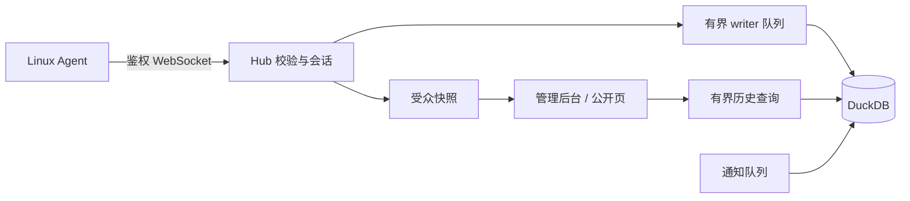

# 架构

Hub 是一个 Rust 进程，嵌入两个 React 应用与 DuckDB。每台主机运行一个 Agent；没有消息队列、ORM 或独立数据库服务。

| 模块 | 责任与边界 |
| --- | --- |
| `agent/src/collect.rs` | 宿主事实、瞬时指标、逐接口计数；不计算账期累计 |
| `agent/src/main.rs` | 配置、TLS、上报、重连、TCP 任务；不执行远程命令 |
| `server/src/agent_ws.rs` | 节点身份、报告顺序、输入限额、实时快照 |
| `server/src/api.rs` / `auth.rs` | HTTP 权限、准入与凭据生命周期 |
| `server/src/db/` | 单 writer、分析 reader、事务、历史和文件替换 |
| `server/src/notify.rs` | 去重、宽限期和渠道发送 |
| `server/src/distribution.rs` / `deploy/` | 验证本地 Agent 工件、最小权限安装 |
| `admin/` / `web/` / `shared/` | 页面与客户端契约；权限最终由 Hub 决定 |

报告状态锁串行处理单个节点的报告与撤销。展示读取独立快照，数据库操作进入阻塞任务。
writer 提交后才确认，批内失败回滚整批；历史查询和备份使用有界分析连接池。
资源常量及其测试是上限的权威：writer 队列 512、单批最多 256、历史准入 4、分析 reader 3；公共实时连接 64、管理员预留 32。
Agent 最多 64 个监测任务，DNS 阻塞任务上限 4。DuckDB 内存参数不是整个进程的 RSS 上限。

管理员 Cookie、节点令牌、短期注册 key 和发布来源证明分别管理。匿名快照不含管理字段。
默认回环监听，外部 HTTPS 由可信反向代理提供；运行时只使用已验证本地分发和本地国家库。
