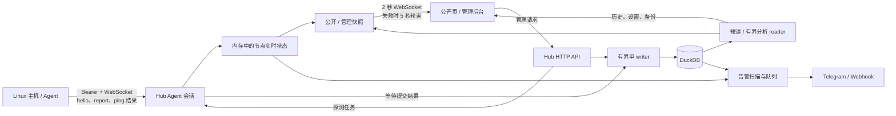

# romi 代码导览：功能、交互、业务与数据

本文按当前生产源码描述 romi 的行为，供功能和架构审查。范围是 Hub、Agent、两套内嵌前端及 DuckDB；界面意图以 `designs/romi-next/` 为准，运行行为以代码和测试为准。部署步骤、详细存储限制和验证记录分别见[部署](deployment.md)、[存储](storage.md)与[测试](testing.md)。

## 1. 系统边界与运行形态

romi 采用一个 Rust Hub 管理多个 Linux Agent。Hub 内嵌管理后台、公开状态页和 DuckDB；Agent 读取本机事实与指标，并执行 Hub 指派的 TCP 连接探测。它没有远程终端、任意命令执行、消息队列、独立数据库服务或 Hub 容器交付。默认监听 `127.0.0.1:28080`，对外访问通常由 HTTPS 反向代理接入。

| 代码位置 | 主要责任 |
| --- | --- |
| `agent/src/collect.rs`、`agent/src/main.rs` | Linux 采集、WebSocket 上报、重连与 TCP 探测 |
| `server/src/main.rs`、`agent_ws.rs` | 启动、路由、Agent 身份、报告顺序与实时状态 |
| `server/src/api.rs`、`auth.rs` | HTTP 权限、节点与设置、登录和会话 |
| `server/src/db/` | DuckDB schema、单 writer、历史查询、备份恢复与维护 |
| `server/src/notify.rs`、`geo.rs`、`distribution.rs` | 通知、本地国家库、已验证 Agent 分发 |
| `admin/`、`web/`、`shared/`、`styles/` | 后台、公开页、共享客户端契约与样式 |

Hub 的 `App` 持有数据库、连接中的 Agent、按公开/管理受众分开的快照、查询准入、通知队列与 GeoLite 状态。`agents` 和浏览器快照是进程内状态；节点配置、历史、累计流量与设置在 DuckDB 中。Hub 重启后 Agent 重连并重新提供实时数据，已提交的累计量不依赖内存快照。

## 2. 现有功能与界面交互

### 2.1 公开状态页

公开页入口为 `/`，节点详情为 `/node/{id}`，实现于 `web/src/App.tsx` 和 `web/src/components/`。站点公开页默认关闭；匿名用户访问关闭的页面会转到 `/admin/`。公开时只返回 `node.public = true` 的节点，已登录管理员可以看到完整列表。新建节点的默认值是公开，但既有私有节点不会因为升级而变公开。

| 位置 | 当前可见内容与操作 | 状态处理 |
| --- | --- | --- |
| 首页汇总 | 节点总数、在线数、非在线数、在线节点实时上传/下载速率、全部可见节点累计流量 | 初次加载用骨架；空列表、请求失败分别显示 |
| 卡片 / 列表 | 按优先级降序、原排序、ID 排列；显示状态、CPU/RAM/磁盘、网络速率、本期额度等；卡片还展示系统、账单、到期、连续在线 | 管理员保存 `cards`/`list` 站点默认值；访客切换只在本页内生效，不写设置 |
| 节点详情 | 资源、监测、流量三类历史；系统事实、容量、Agent 版本、累计量；已登录时可见地址 | 支持深链、刷新、后退；不存在或未公开时回到列表；历史失败可重试，刷新失败保留上次数据 |
| 历史图 | 资源页显示 CPU、RAM/ZRAM/普通 Swap、磁盘、进程、上传/下载、TCP/UDP 连接；监测页显示延迟、范围与丢包；流量页聚焦上下行 | 每类保留自己的时间范围；60 秒后重取；缺样断线，不把未知值画成 0；监测图可削峰、隐藏探测和拖动时间刷选 |

访客可选 1 小时、6 小时、24 小时和 7 天资源/流量范围，监测页至 24 小时；已登录详情另可选 30 天、90 天和 1 年。浏览器按可绘制像素给出点数预算，Hub 决定最终桶宽。网络、容量、流量使用共享 IEC 字节单位；可用带宽是单独配置的十进制 Mbps/Gbps。浏览器主题遵循本地保存值或系统偏好，切换结果保存在 `localStorage`。

“在线”取决于当前 Agent 连接；未报告过为“未连接”；断开后在可配置宽限内显示“重连中”，之后显示“离线”。首页的“离线服务器”计数直接按当前连接数计算，因而包含处于“重连中”的节点。连续在线时段由 Hub 持久化的 `online_since` 和最后上报时间计算，系统本次启动时长则来自 Agent 的 `uptime`，两者不同。

### 2.2 管理后台

`/admin/` 规范化为 `/admin/nodes`；后台各区有独立路径，可刷新或直接打开。未登录时显示账号密码表单及已配置时的 GitHub 登录入口；登录成功后停留在原先请求的路径，GitHub 登录经回调返回后也会恢复该路径（仅限 `/admin/` 内）。桌面侧栏与移动端弹窗导航指向节点、监测、通知、数据、安全、设置；顶部提供公开页、明暗切换、退出登录。表单有忙态和错误提示，删除、令牌换发、维护、恢复使用确认弹窗；节点弹窗关闭后把焦点还给触发控件或主内容。

| 页面 | 当前操作与行为 | 源码 |
| --- | --- | --- |
| 节点 `/admin/nodes` | 名称/IP/标识搜索、全部/在线/离线筛选、复制 IPv4/IPv6 与 `node-{id}`、查看版本；添加、编辑、账单与流量、安装、换发令牌、删除 | `admin/src/components/Admin.tsx` 的 `Nodes`、`NodeForm`、`BillingForm`、`InstallDialog` |
| 批量注册 | 开启一小时窗口、复制含短期 key 的命令、倒计时和提前关闭；每台 Agent 用 key 换自己的长期令牌 | `useRegisterWindow`、`RegisterDialog` |
| 监测 `/admin/ping` | 创建/编辑/删除 TCP `host:port` 任务、设置 5–3600 秒间隔和执行节点；删除时连历史结果一起清除 | `Ping` |
| 通知 `/admin/notify` | Telegram/Webhook 凭据与模板、预览、分别测试、显式清除；批量开关节点离线通知；设置离线宽限、流量阈值、到期天数和登录提醒 | `Notify`、`OfflineNodes` |
| 数据 `/admin/data` | 文件/WAL/可复用空间与历史统计、周期维护、手动维护、下载备份、分片上传恢复及取消 | `Data` |
| 安全 `/admin/security` | 查看/撤销其他会话、配置 GitHub OAuth 与允许名单、修改本地账号和密码（需验证当前密码） | `Security`、`Sessions` |
| 设置 `/admin/settings` | 站点名称、分钟保留天数、连续在线重置阈值、公开页开关与默认视图、GeoLite Country 下载/取消 | `SettingsTab`、`GeoSettings` |

节点编辑只提交改动过的字段。额度按 GB/TB 输入并转换为字节，`0` 表示不限；流量修正区的未改字段不会覆盖累计量。价格、币种、付款周期与到期日期在独立账单表单中编辑。优先级为 `0–999999`，数字越大越靠前；当前后台以数值输入调整它。API 仍有整表 `PUT /api/nodes/order`，可一次写入排序及优先级。节点级 `public` 由编辑弹窗的「公开状态页」选择控制，管理列表仍显示「私有」标记。以上按当前组件代码记录，不能把 API 能力当作已有界面入口。

两端共用视觉变量和响应式样式；窄屏时后台改用抽屉导航，节点表格收敛为分行布局，公开卡片由多列变单列。按钮、输入和弹窗保留可见键盘焦点，样式照顾触屏尺寸及减少动画偏好。现有浏览器回归覆盖 320px 等 Chromium 视口；这不等于真实 iOS、Safari 或读屏器已经验收。界面约束见[产品与界面约束](product/constraints.md)。

### 2.3 浏览器数据与失败处理

两套前端首先请求 `/api/me` 判定身份和站点配置，再经 `/api/nodes` 取初始节点列表，随后连接 `/api/ws`。Hub 每 2 秒推送一份按受众生成的节点快照；WebSocket 失败时页面每 5 秒轮询，并尝试重新连接。会话被撤销或公开页被关闭后，服务端停止原连接，客户端重新读取身份或转登录页。详情历史按当前标签调用 `/api/nodes/{id}/metrics?hours=&points=&series=`；切换窗口会取消旧请求，避免旧数据覆盖新窗口。延迟图的框选缩放按时间而非行号保存，每分钟刷新后保持；右端贴近最新样本时继续跟随，切换标签或范围时清除。共享 `shared/http.ts` 保留 HTTP 状态码，且对 `204 No Content` 不尝试解析 JSON。

公开节点响应包含状态、指标、硬件事实、国家代码、账单、额度和累计流量；不包含主机名、IP、备注、通知设置或凭据。公开实时指标使用字段白名单，不透出 Agent 的原始内核网络累计计数。管理端才获得地址、主机名、备注和通知开关。权限由 Hub 的会话与节点可见性检查决定，隐藏界面按钮不能代替它。

## 3. 业务流程与数据流

### 3.1 首次启动、认证与节点接入

1. Hub 打开/初始化数据库并在首次启动生成本地管理员密码；交互式运行显示一次，服务安装可写入权限 `0600` 的文件。管理员密码以 Argon2 摘要保存于 `setting`，修改后清除引导凭据文件。
2. 本地登录同时核对账号与密码。GitHub OAuth 校验回调 `state`，且允许名单为空时拒绝所有人；名单条目按用户名或数字账号 ID 匹配，接受时两者都记入日志。登录发放 14 天会话：Cookie 为 HttpOnly、SameSite=Lax，HTTPS 条件满足时标记 Secure；`session` 表只存令牌 SHA-256 摘要。注销、撤销、账号/密码修改会使对应会话失效。
3. 添加节点需在经 Hub 校验的 HTTPS 域名入口操作。Hub 原子创建 `node` 与 `traffic` 行，按分配器取得 ID，返回只显示一次的长期令牌；安装命令不把长期令牌放进 shell 命令行，安装器在节点本机读取它。注册窗口是另一入口：一小时有效、最多 100 个新节点，短期 key 换取各自长期令牌。
4. Hub 仅在启动时载入通过版本、大小、SHA-256、ELF 架构及路径检查的本地 Agent 分发。`/install.sh` 与版本化 `/agent/v{version}/{target}` 服务于精确工件；未配置时安装入口不可用。安装器下载元数据和二进制后再次核对哈希，可安装 systemd 或 OpenRC 服务。
5. Agent 使用 `Authorization: Bearer` 建立 `/api/agent/ws`。Hub 再查摘要并激活唯一节点会话；连接时即视为在线。轮换令牌、删除节点或恢复数据库会退休旧会话，等待在途报告完成，避免旧连接继续写入。

密码验证同时仅放行 1 次昂贵校验，按来源地址限制失败尝试；注册失败使用独立计数。Hub 只信任本机反向代理提供的转发 IP，真实授权仍由会话或节点令牌决定。

### 3.2 采集、累计与历史

Agent 的 `hello` 上报主机名、OS/内核/架构、CPU、容量、版本及本机双栈地址。Hub 将这些较慢变化的事实写到 `node`。Agent 默认每 3 秒报告一次，可设置为 3–60 秒整数；报告包含 CPU/负载、RAM、ZRAM、普通 Swap、磁盘、网络速率与绝对计数、连接数、进程数和系统 uptime。Agent 从 Linux `/proc`、`/sys` 与挂载信息读取，不保存计费累计量；`--iface` 可选指定或排除网卡。

Hub 验证上报字段后，按单节点会话锁串行处理：在 `traffic` 中比较同一计数 epoch 的绝对 `rx/tx`，把非负增量计入终身、本期和当天计数；首次上报、重启、接口集合变化或计数回退只重建基线。没有有效计数时不会写一个伪零基线。Agent 新出现的网卡也不会让即时速率产生“整段寿命流量”尖峰。账期与“今天”依 Hub 本地日历；账期重置日为 1–31，短月落在月末。`sum`、`max`、`up`、`down` 仅规定用量和提醒如何取本期上下行，累计的两方向字节一直独立保存。

每份有效报告刷新实时内存快照、`node.last_seen` 与连续在线起点。跨过分钟边界时，Hub 从该会话累积的报告生成分钟行：CPU/内存等用采样均值，网络速率由 Hub 的累计量变化计算；每节点每分钟最多一行，实时页仍显示最新一份报告。查询历史时合并 `metric` 与 `metric_hour`，按返回的桶宽做加权平均；没有样本的时间段保留空白。分钟保留默认 30 天、可配 1–3650 天，过期完整小时汇总到小时表，小时表保留一年；清理不减少 `traffic` 中的累计量。匿名历史窗口最多 7 天，管理员最多 1 年，最多同时处理 4 个历史请求。

### 3.3 TCP 监测与通知

管理员保存探测目标、间隔与节点指派。Hub 校验 `host:port`（IPv6 使用 `[地址]:port`）和每节点最多 64 个任务，在一个事务内替换任务指派，并立刻向在线 Agent 推送。Agent 保留未变化任务的计时器，先解析 DNS 再尝试最多 3 个地址；TCP 握手延迟按毫秒记录。连接失败写 `-1` 作为丢包，DNS 解析超时则没有样本。Hub 只接受该节点仍被指派任务的结果，写入 `ping_record`；历史桶以整数延迟分布计算中位数、范围和丢包率，不能将失败当作 0 ms。

通知扫描每 30 秒读取连接状态及本期流量。每节点离线开关生效后，断开超过通知宽限期才提醒；短暂断线不产生恢复提醒，抖动另有延长宽限。达到配置的流量阈值与 100% 时分别提醒；到期摘要从 Hub 本地时间 09:00 起每日发送，在线且过期的周期账单可向后滚动并发续期通知；管理员登录也可提醒。事件进入容量 64 的进程内队列，Telegram 与 Webhook 各自最多重试 3 次。队列满或重试耗尽会记录警告并放弃，因此界面“已排队”不能等同外部送达；后台的“发送测试”直接尝试目标渠道并报告其错误。

### 3.4 国家库、备份与维护

GeoLite Country 下载由管理员指定 HTTPS 直链，限制 32 MiB，并验证 MMDB 类型；成功后原子替换数据库同目录的 `GeoLite2-Country.mmdb`，按连接来源 IP 更新国家代码。进度可查询，下载可取消，失败保留旧库。该文件不属于 DuckDB 备份。

备份从一个只读 MVCC 事务导出九张持久业务表为 Parquet，再加入记录 schema/引擎/行数/SHA-256 的 manifest，打包成格式 3 的 tar.gz；`session` 不入备份。恢复上传以 4 MiB 分片顺序发送；取消或离开数据页会在分片边界停止，最后一个分片发出后不可取消，因此“已取消”只在 Hub 未收到最后分片时出现。Hub 单请求上限 8 MiB、总压缩归档上限 256 MiB，并限制成员数与展开大小。Hub 先校验归档、关系和 staging 库——这段期间数据库保持可读——再在替换栅栏内切换数据库；失败时保留或恢复原文件。恢复成功清除旧会话、给当前操作人新会话，并让 Agent 重新鉴权连接。手动维护清理过期历史、执行 CHECKPOINT，仅可复用空间达到阈值时重写文件并报告实际回收字节；周期维护默认关闭，可选 7/30/90/180 天。普通保留期清理仍按小时执行。

## 4. HTTP / WebSocket 契约索引

| 受众 | 接口 | 作用与权限要点 |
| --- | --- | --- |
| 浏览器访客 / 管理员 | `GET /api/me`、`GET /api/nodes`、`WS /api/ws` | 身份、可见节点和实时快照；公开页关闭时匿名列表/流拒绝，管理会话失效时流断开 |
| 浏览器访客 / 管理员 | `GET /api/nodes/{id}/metrics` | 逐节点历史；匿名只能读公开节点，窗口与并发受限 |
| 登录 | `POST /api/auth/login`、`POST /api/auth/logout`、`GET /api/auth/github[/callback]` | 本地凭据、注销与 OAuth 会话 |
| 管理员 | `POST /api/nodes`、`PUT/DELETE /api/nodes/{id}`、`PUT /api/nodes/order`、`POST /api/nodes/{id}/token`、`PUT /api/nodes/{id}/traffic` | 节点、排序、令牌与流量校正；添加节点另需 HTTPS 域名入口 |
| 管理员 | `POST/DELETE /api/register-window`、`GET/POST /api/ping-tasks`、`DELETE /api/ping-tasks/{id}` | 注册窗口及探测任务 |
| 管理员 | `GET/PUT /api/settings`、`GET /api/sessions`、`DELETE /api/sessions/{id}`、`POST /api/notify/test`、`GET/POST/DELETE /api/geolite` | 设置、会话、渠道测试和国家库 |
| 管理员 | `GET /api/db`、`GET /api/db/backup`、`POST /api/db/restore`、`POST /api/db/maintenance` | 数据统计、备份、恢复与维护 |
| Agent / 安装器 | `WS /api/agent/ws`、`POST /api/agent/register`、`GET /api/agent/distribution`、`GET /install.sh`、`GET /agent/v{version}/{target}` | 节点令牌、短期注册 key 和已验证本地分发；另有 `GET /healthz` 健康检查 |

Hub 通常限制 HTTP 请求体为 64 KiB，恢复分片单独放宽。浏览器实时连接分配 64 个匿名席位和 32 个管理席位，单个来源地址最多占 4 个匿名席位（IPv6 按 /64 计），超出返回 429；两个 WebSocket 的消息和单帧上限均为 64 KiB。Hub 同时读取实时连接，浏览器关闭时立即归还席位。页面响应带 CSP、`X-Frame-Options`、`X-Content-Type-Options` 与 `Referrer-Policy`。路由细节和失败状态以 `server/src/main.rs`、`api.rs` 为准。

## 5. DuckDB 数据库设计

### 5.1 表与关系

生产持久化是单个 `--db` 指定的 DuckDB 文件（默认 `romi.db`）。当前应用 schema 为 **3**，bundled DuckDB 引擎为 **v1.5.5**；应用 schema、引擎版本与备份格式分别校验。下表覆盖十张应用表和两张内部元数据表。

| 表 | 主键 / 关键字段 | 作用与关系 |
| --- | --- | --- |
| `setting` | `key`、`value` | 站点、账号密码摘要、GitHub、通知、保留与注册窗口等键值设置；部分值属于凭据，应保护数据库文件 |
| `romi_id` | `name`、`next` | 为 `node`、`ping_task` 分配 ID；每次打开和恢复数据库时按现存最大 ID 重同步 |
| `romi_schema` | 固定 `id=1`、`version`、`engine`、`written_by` | 应用 schema 元数据和写入版本 |
| `node` | `id`、唯一 `token_hash`；配置、账单、硬件事实、地址、`last_seen`、`online_since` | 节点主表；长期令牌只存 SHA-256 摘要，地址和备注只供管理态 |
| `traffic` | `node_id`；`boot_id`、上次绝对计数、终身/本期/当天双向累计、周期起点 | 与节点一对一；独立于历史保留期 |
| `metric` | `(node_id, ts)`；CPU、RAM/Swap/ZRAM、磁盘、网络速率、连接/进程 | 每节点每分钟最多一行；部分新指标可为 `NULL`，表示旧 Agent 或读取失败 |
| `metric_hour` | `(node_id, ts)`；`samples`、各指标加权和与有效样本数 | 过期分钟数据的小时摘要；大整数和用 `DECIMAL(38,0)` 保证 Parquet 往返精度 |
| `ping_task` | `id`；名称、目标、间隔 | TCP 探测定义 |
| `ping_node` | `(task_id, node_id)` | 任务与执行节点的多对多指派 |
| `ping_record` | `(node_id, ts, task_id)`；`latency` | 探测样本，`-1` 为连接失败 |
| `ping_hour` | `(node_id, ts, task_id, latency)`；`samples` | 每小时按整数延迟计数的分布，可重建中位数、范围和丢包 |
| `session` | `token_hash`、`expires_at` | 登录安全状态，运行库内存在，但不进入备份 |

DuckDB 没有在这些表上声明外键级联。`Db::create_node` 同事务写 `node` 与 `traffic`；`Db::save_ping_task` 核对节点及指派、一次替换全部关联；删除节点/探测任务时在同一事务显式清除其历史与关联。恢复在切换前校验孤儿关系。`metric` 与 `ping_record` 的复合主键负责去重；配置的“未传字段”与“显式清空”由补丁语义区分，例如 `expires_at: null` 才清除到期日。

**ID 边界：**分配器只前进。启动和恢复执行的 `resync_ids` 用 `GREATEST` 把 `next` 抬到现存最大 ID 加一，不会调低，因此删除末尾节点或探测任务后重启也不会再次发放该 ID。备份不含 `romi_id`，所以恢复会把当前库的计数器作为下界写进 staging 库，备份之后创建又被恢复抹掉的 ID 同样不再发放。`a_deleted_id_stays_retired_across_a_restart` 与 `a_restore_does_not_reissue_ids_created_after_the_backup` 覆盖这两条路径。

### 5.2 读写、保留和文件生命周期

所有变更经容量 512 的单 writer 队列；同类遥测最多 256 个操作合入一个事务，提交成功才答复调用者。批内单条失败时整批回滚后逐条重放，只有出错的那条得到失败答复；`COMMIT` 本身失败才整批报告失败。短元数据读使用独立连接，历史/备份使用 3 个分析 reader，历史查询有 30 秒中断上限，匿名与管理各有独立准入配额。备份只占读取快照；恢复或真正重写文件才推进数据库 generation 并拒绝已过期的排队写入，替换栅栏只在换文件的瞬间排除 reader。实时节点列表来自 Agent 的最近发布副本和已提交配置，避免慢查询堵住页面。

启动会拒绝非 romi 数据库和不匹配的引擎；schema 迁移在事务中执行。文件数据库另持有 `<db>.lock` 排他锁，并限制主文件、WAL、临时目录与锁文件的权限。内存数据库仅用于测试。正常关闭会停止接收新作业，排空 writer、CHECKPOINT、等待 reader 结束后释放连接与文件锁。备份格式 3 可恢复已知的 schema 2/3 数据；较新的 schema 不能被旧 Hub 直接打开。更细的备份校验与回滚步骤见[存储架构](storage.md)。

## 6. 代码核对入口与审查重点

| 需要核对的事实 | 源码及现有回归入口 |
| --- | --- |
| 页面路径、状态与交互 | `web/src/App.tsx`、`web/src/components/NodeDetail.tsx`、`admin/src/App.tsx`、`admin/src/components/Admin.tsx`；`e2e/public.spec.mjs`、`e2e/admin.spec.mjs` |
| Agent 报告与探测 | `agent/src/collect.rs`、`agent/src/main.rs`、`server/src/agent_ws.rs`；各文件内 Rust 单元测试 |
| API 权限、节点、认证 | `server/src/main.rs`、`server/src/api.rs`、`server/src/auth.rs`；对应模块测试 |
| 累计、查询、schema、备份 | `server/src/db/mod.rs`、`schema.rs`、`queries.rs`、`backup.rs`；`server/src/db/tests.rs`、`server/tests/duckdb_engine.rs` |
| 通知、国家库、分发 | `server/src/notify.rs`、`geo.rs`、`distribution.rs`；对应模块测试与 `deploy/agent/install.sh` |

审查时特别区分三个边界：**在线连接状态**与**告警离线判定**使用不同宽限；**实时速率**与**账期累计**来自不同计算；**API 支持的字段**不必然有后台操作入口。本文是对源码的静态梳理，不把既有测试文件或历史验证记录当作本次运行结果。
